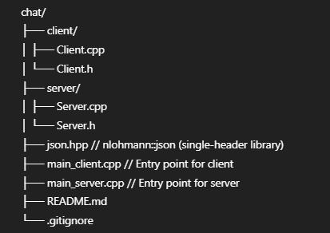

# 🗨️ C++ Chat System

A multi-client chat system built using C++ and Winsock, where:

- Clients and server communicate using JSON format via TCP sockets.
- Clients can send messages to the server.
- The server can broadcast or send messages to specific clients (by ID or IP).
- Supports LAN and internet-based messaging (via port forwarding or Ngrok).

---

## 📁 Project Structure

## ⚙️ Features

- JSON-based messaging (using [nlohmann/json](https://github.com/nlohmann/json))
- Broadcast and private message support
- Multithreaded server using `std::thread`
- Client identification using Client ID or IP address
- Works across devices on the same Wi-Fi or public internet (via port forwarding)

---

